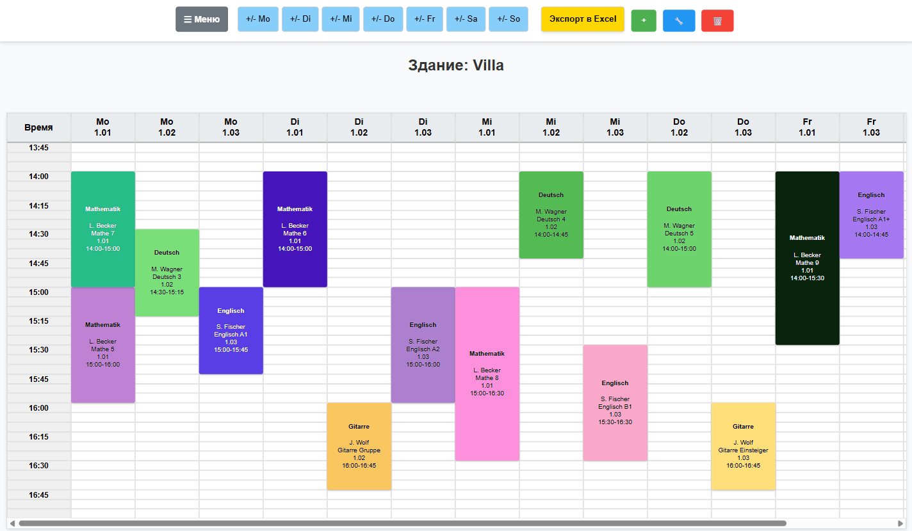
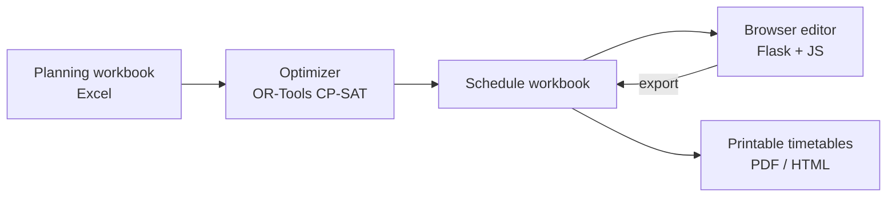

# ScheduleGen

Weekly timetable planning for a children's education centre. A constraint solver (Google OR-Tools CP-SAT) places group lessons so that teachers, groups and rooms never clash. Staff then fine-tune the week in a browser editor, add individual and tutoring lessons, and print timetables for teachers and groups.

I built it for Kinder- und Elternzentrum Kolibri e.V. in Dresden.



*The browser editor with a fictional week of 24 lessons. The solver placed them in under a second; the input comes from [`examples/create_demo_week.py`](examples/create_demo_week.py).*

## What it does

- Reads lessons from an Excel planning workbook: teacher, group, main and alternative rooms, building, duration, a fixed start or a time window, linked lessons and pauses.
- Finds conflict-free start times and rooms with CP-SAT and writes the timetable back to Excel.
- Turns the result into an interactive browser editor (Flask) with logins, roles, edit locks and protection against overwriting someone else's newer changes. Depending on their role, users add individual, tutoring and trial lessons or room rentals; admins export the edited week back to Excel.
- Prints timetables per teacher and per group (PDF and HTML) and exports calendar files.
- Runs on a Windows office PC with a small desktop control panel.

## How it works



## Try it

You need Windows and Python 3.13 or newer with Tcl/Tk. In PowerShell, from the repository folder:

```powershell
py -3.13 -m venv .venv
.\.venv\Scripts\python.exe -m pip install -r requirements.txt
.\.venv\Scripts\python.exe examples/create_demo_week.py
.\.venv\Scripts\python.exe main_sch.py examples/generated/demo_week.xlsx --output examples/generated/demo_week_schedule.xlsx --time-limit 10 --time-interval 5
```

The first script writes a planning workbook with invented groups and teachers; the second solves it and saves the timetable as `examples/generated/demo_week_schedule.xlsx`. [`examples/create_demo_workbook.py`](examples/create_demo_workbook.py) is a two-lesson version that documents the input format cell by cell.

Plain `.xlsx` files are read and written with openpyxl, so the optimizer runs without Excel. The Excel automation used by the desktop workflow needs desktop Excel and `pywin32`. Dependency versions are not pinned. Optional raster, calendar and legacy HTML-to-PDF exports are listed in [requirements-export.txt](requirements-export.txt); they also need Poppler or wkhtmltopdf, which pip does not install.

## Running the editor locally

The editor is meant for a local network, not for the open internet. To run your own instance:

1. Copy [config.example.json](config.example.json) to `config.json` if you use the desktop app. Automatic copying of generated files is off until you set a destination.
2. Create `gear_xls/config/` and copy [server.example.json](examples/server.example.json) to `gear_xls/config/server.json` (it binds to `127.0.0.1:5055`) and [users.example.json](examples/users.example.json) to `gear_xls/config/users.json`.
3. The example user has an empty password hash, so nobody can log in yet. Set a password from the repository root with the virtual environment's Python; it is read without echo and never appears in a command line:

```python
from getpass import getpass
import json
from pathlib import Path
import bcrypt

path = Path("gear_xls/config/users.json")
data = json.loads(path.read_text(encoding="utf-8"))
data["users"][0]["password_hash"] = bcrypt.hashpw(
    getpass("Local demo password: ").encode(), bcrypt.gensalt()
).decode()
path.write_text(json.dumps(data, indent=2) + "\n", encoding="utf-8")
```

The editor works on a generated schedule, so start from the desktop app (`gui.py`) or `gear_xls/main.py`, which convert a schedule workbook into the editor page. Starting `gear_xls/server_routes.py` on its own gives you an empty editor. The full Excel-to-editor pipeline is described in [PROJECT_MAP.md](PROJECT_MAP.md). The server writes its state, logs and a generated session key next to the code, so use a separate copy for experiments.

## Working on the code

- Existing `config.json`, `gear_xls/config/`, planning workbooks and generated state are local files. Keep them when you pull new code; the examples are templates, not replacements.
- Ignore rules keep local data and outputs out of Git, but they can't spot a private value pasted into a tracked file. Look at `git diff --cached` before pushing.
- JSON and text files are ignored by default. If a new source file or test fixture needs one of these formats, add a narrow exception after checking what's inside.

Tests run with pytest (install [requirements-dev.txt](requirements-dev.txt)). Some editor tests create state in temporary folders, but not every older script is isolated, so run them in a separate copy:

```powershell
python -m pytest -q tests/test_rental_conflicts_dates.py tests/test_rental_excel_roundtrip.py tests/test_rental_model_editor.py tests/test_rental_operator_sync.py tests/test_schedule_js_refresh.py tests/test_server_log_policy.py
```

## Where things are

| Area | Entry points |
| --- | --- |
| Optimizer and input | `main_sch.py`, `reader.py`, `scheduler_base.py`, constraint modules |
| Desktop app | `gui.py`, `gui_services/`, `server_tray.py` |
| Browser editor | `gear_xls/server_routes.py`, `gear_xls/state_manager.py`, `gear_xls/static/`, `gear_xls/js_modules/` |
| Excel exchange | `gear_xls/schedule_exchange.py`, `gear_xls/excel_parser.py`, `gear_xls/excel_exporter.py` |
| Printable timetables | `visualiser/`, `visualiserTV/` |
| Excel macros (VBA) | `xlsx_initial/PlanningMacros.bas`, `gear_xls/Modul1.bas` |

Parts of the interface and older module notes are in Russian or German, and the Excel layout follows one centre's planning sheet.

## How it's built

I develop ScheduleGen with AI coding agents. I set the requirements, decide how the model and the data flow work, split changes into small steps with acceptance criteria, and test each step before it goes in. The agents (Claude Code and OpenAI Codex) write most of the code, and many commits name them in a `Co-authored-by` line.

## License

The code is available under the [MIT License](LICENSE). The two VBA modules are the exception: they belong to Kinder- und Elternzentrum Kolibri e.V. and may only be reused with its permission, see [NOTICE](NOTICE).
